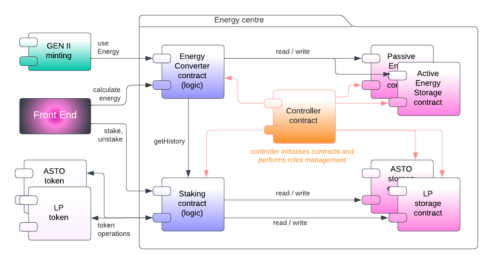

# Architecture

Status:  

- [x] DRAFT
- [ ] APPROVED
- [ ] SUBMITTED
- [ ] AUDITED
- [ ] PASSED & PUBLIC

## Overview

In case we want to update logic we can develop and deploy a completely new logic contract. We are able to change the address of the contract that has rights to read/write operations by introducing Controller, that can call some admin functions, like `pause()` and can init contracts with other contract addresses with just one call from Manager (Multisig wallet of DAO).

To simplify further, we hardcode storage addresses in the logic contracts. Not a big deal, as logic contracts could be re-deployed.

Controller also used to set contract addresses that have write access.

### Pros:

Simple and safe: medium complexity, clear logic, good readability, and low development efforts. OpenZeppelin contracts to use.

### Cons:

All contracts should be aware of Controller and roles.
