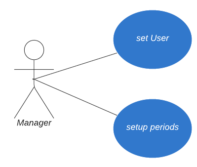
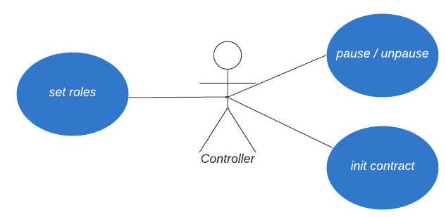

# Energy Converter use cases

Status:  

- [x] DRAFT
- [ ] APPROVED
- [ ] SUBMITTED
- [ ] AUDITED
- [ ] PASSED & PUBLIC

 

## Terms

- **Manager** - DAO address, all the decisions should be made/approved by the majority of members.
- **Controller** - Contract, which purpose is mainly to reduce the number of votes required to upgrade other contracts.

_Contoller perform operations that require updating more than a one contract, while Manager does a specific (one contract related) operations._

 

## Manager use cases

### Setup new mining period `addPeriod()`

Manager can set up a new mining period: start, finish, and token multipliers.

### Update existing mining period `updatePeriod()`

Manager can update a mining period: start, finish, and token multipliers.

### Set Minting contract that can use energy `setUser()`

The Manager can set/update the address of the logic contract that is allowed to use Energy.

 

## Controller use cases

### Pause (OZ Pausable.sol) `pause()`

The Controller can pause the contract, which should stop both, staking, and unstaking. Effectively, it means no one can withdraw their funds or add more funds.

### Unpause (OZ Pausable.sol) `unpause()`

The Controller can unpause paused contract to allow staking and unstaking again.

### Update Controller contract (OZ AccessControl.sol) `setController()`

The Controller can update `CONTROLLER_ROLE` to assign another Controller contract in case it's upgraded.

### Update Manager contract address (OZ AccessControl.sol) `setManager()`

The Controller can update `MANAGER_ROLE` to assign Manager (DAO multisig) contract that can perform manager functions (setup periods).

### Initialize contract `init()`

The Controller can initialize the contract with all required addresses (tokens, storage, logic, controller, ...).

 

## User use cases

### Calculate the amount of energy earned so far `calculateEnergy()`

How much energy is mined by the specific user.

### Get the amount of energy already spent `getConsumedEnergy()`

Returns the amount of energy that was already spent by user.

### Get remaining energy `getEnergy()`

getEnergy = earned Energy - consumed Energy

### Get period details `getPeriod()`, `getCurrentPeriod()`, `getCurrentPeriodId()`

Details about mining period:

- `getCurrentPeriod()` - Get the current period details based on current timestamp
- `getCurrentPeriodId()` - Get the current period id based on current timestamp
- `getPeriod()` - Get period data by period id `periodId`

 

## Minting contract interface

### Use Energy `useEnergy()` **_onlyUser_**

The minting contract can call the Energy Converter contract and request the specific amount of Energy required for minting.

That amount of energy (if sufficient) will be transferred to the Minting contract, which means the energy balance of the user in the Energy Storage contract will decrease.
