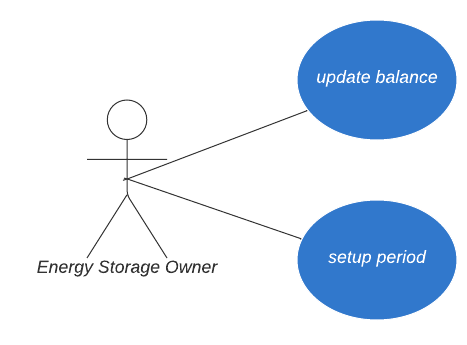

# Energy Converter contracts use cases

Status:  

- [x] DRAFT
- [ ] APPROVED
- [ ] SUBMITTED
- [ ] AUDITED
- [ ] PASSED & PUBLIC

## Energy Converter Storage use cases

    Owner is a DAO address, all the decisions should be made/approved by the majority of members.

### Setup new mining period `setupPeriod()`

The Owner can set up a new mining period: start, finish, and token multipliers.

### Set storage manager (OZ AccessControl.sol)

The Owner can set/update the address of the logic contract that is allowed to do CRUD operations. We use `OZ's AccessControl`.

### Update Balance (CRUD operation) `updateBalance()` **_onlyManager_**

The Manager (a logic contract) can set/update the balance of the specified wallet.

### Pause (OZ Pausable.sol) `pause()` _onlyOwner _

The Owner can pause the contract, which should stop both, staking, and unstaking. Effectively, it means no one can withdraw their funds or add more funds.

### Unpause (OZ Pausable.sol) `unpause()` _onlyOwner_

The Owner can unpause paused contract to allow staking and unstaking again.

### Transfer ownership (OZ Ownable.sol) `transferOwnership()` _onlyOwner_

It will be done at least once, automatically, at contract creation. After the contract was created, the ownership will be transferred to the specified address DAO.

 

## Energy Converter Logic use cases

### Calculate the amount of energy available `calculateEnergy()`

How much energy is mined by the specific user.

### Get the total amount of energy in the pool `getTotalEnergy()`

How much energy is in the pool.

### Estimate current energy production rate `estimateEnergy()`

Returns the amount of energy per day that can be generated by all of the user's current stakes.

### Get current event’s Energy pool share `getPoolShare()`

Returns what is the user share of the whole event energy pool.

 

## Minting contract interface

### Set Minter `setMinter()` _onlyOwner_

The Owner can set/update the address of the logic contract that is allowed to do CRUD operations.

### Use Energy `useEnergy()` **_onlyUser_**

The minting app can call the Energy centre and request the amount of Energy accumulated by the user. That amount of energy will be transferred to the App, which means the balance of the user will decrease if the user has that amount.
