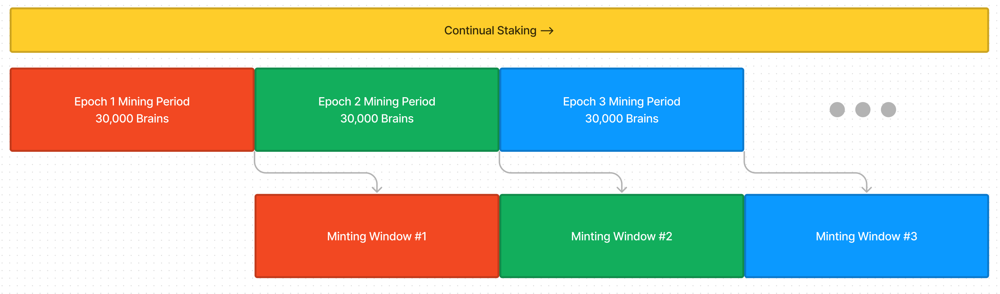
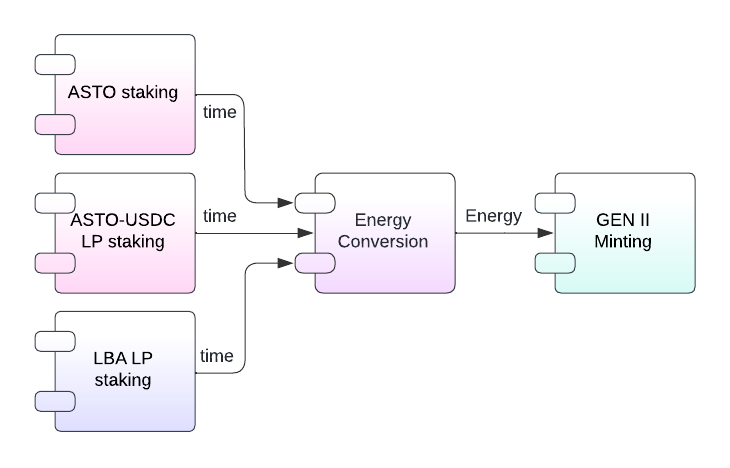
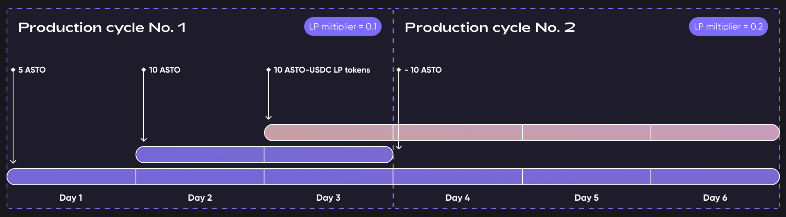

# Glossary

Status:  

- [x] DRAFT
- [ ] APPROVED
- [x] SUBMITTED
- [ ] AUDITED
- [ ] PASSED & PUBLIC

## The logic of Gen II brains minting event

The Gen II brains minting event is going to have 3 mining periods and 3 minting windows. Each window has predefined 30.000 brains to be minted.

After Mining 1 is over, Mining period 2 AND Minting Window 1 start.

Energy minted during the Mining period becomes available during the Minting window.

The energy and brains left non-minted from the previous Window will migrate to the next Minting period.

Brains left after Window 3 can be withdrawn by the ASM and, probably, traded openly for ASTO OR destroyed.

The time that tokens remained staked will be mapped to the Energy in a 1:1 ratio.

Still, we want to use token multipliers to reward ASTO or LP token holders differently. Token multipliers are set on contract deployment but can be changed by the contract owner (DAO).

### Event architecture

    Mining period a.k.a. Energy conversion, means conversion of time that user tokens were staked to the energy earned by user, that can be spent on GEN II brains minting.

Staking, Conversion, and Minting are separated.

 

## Staking

Staking is the process of locking your ASTO or LP tokens in the contract.

In return, you will get a reward for the time you locked your tokens, but later. No direct reward for staking tokens for the user. See reward section.

All staking/unstaking history is recorded.
You can unlock (unstake) your tokens anytime and get them back.

### Unstaking

Unstaking is the process of unlocking (getting back) your ASTO or LP tokens.
No direct reward for the user.

 

## Energy conversion (Mining)

_see [energy.md](energy.md)_

### Active Energy conversion

There are 3 mining cycles when user’s energy is calculated based on user’s tokens staking time.

Technically it means the Converter contract calls the Staking contract to get the time users tokens remained staked and apply conversion from time to energy units.
There is a general conversion rate of time into energy: e = Token \* time:

staking 1 token for 1 second gives you 1 energy unit

Staking ASTO tokens COULD give you more or less energy units than staking LP tokens, as determined by token multipliers.

---

Example:

- **Staking history**
  - _astoHistory_ for cycle 1 = 5 + 15 +15
  - _lpHistory_ for cycle 1 = 10
  - _astoHistory_ for cycle 2 = (15-10) \* 3 days
  - _lpHistory_ for cycle 2 = 10 \* 3 days
- **Energy calculations**
  - Energy for cycle 1 = astoHistory 1 + lpHistory 1 * LPkoef 1 = 35 + 10*0.1
  - Energy for cycle 2 = astoHistory 2 + lpHistory 2 * LPkoef 2 = 15 + 30*0.2

---

### Passive Energy conversion

Passive Energy can be earned by keeping LP tokens staked in the LBA contract (if the user has any).

Passive Energy has its own multiplier to reward users that keep their LP tokens staked but generally, the conversion is the same: the longer you keep your tokens in the LBA contract, the more Energy (passive energy) you gain from that.

 

## Minting

Energy is used by Minting contract, which requests the energy from the Calculations contract and if the specified user (wallet) has enough energy, it is transferred to the Minting contract.

It is not possible to return energy from the Minting contract back to Calculations contract.

Energy for minting is a sum of Active and Passive energies. Passive Energy has to be spent first.

    Passive Energy is available ONLY if user has not claimed LP tokens from LBA contract yet. After LP tokens are claimed the Passive Energy stops its flow (becomes unavailable).
