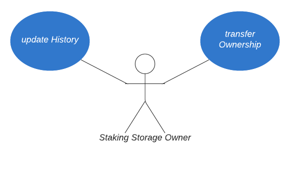
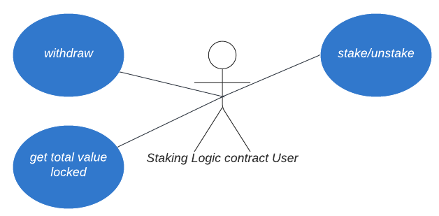

### Set storage manager (OZ AccessControl.sol)

The Owner can set/update the address of the logic contract that is allowed to do CRUD operations. We use `OZ's AccessControl`.# Staking contracts use cases

Status:  

- [x] DRAFT
- [ ] APPROVED
- [ ] SUBMITTED
- [ ] AUDITED
- [ ] PASSED & PUBLIC

## Staking Storage use cases

    Owner is a DAO address, all the decisions should be made/approved by the majority of members.

### Update staking history (CRUD operation) `updateHistory()` **_onlyManager_**

A Manager (logic contract) can set/update the staking history of specified wallet.

### Set storage manager (OZ AccessControl.sol)

The Owner can set/update the address of the logic contract that is allowed to do CRUD operations. We use `OZ's AccessControl`.

### Pause (OZ Pausable.sol) `pause()` _onlyOwner_

An Owner can pause the contract, which should stop both, staking, and unstaking. Effectively, it means no one can withdraw their funds or add more funds.

### Unpause (OZ Pausable.sol) `unpause()` _onlyOwner_

An Owner can unpause paused contract to allow staking and unstaking again.

 

## Staking Logic contract use cases

### Stake tokens `stake()`

Staking is the process of locking your ASTO or LP tokens in the contract.
Users can add more tokens (increase their stake) anytime.

### Unstake tokens `unstake()`

Unstaking is the process of unlocking (getting back) your tokens.
Users can arbitrarily decrease the amount of staked tokens, up to 0.

### Get the total amount of tokens staked in the contract `getTotalValueLocked()`

How many tokens are staked in the contract right now.

### Withdraw token `withdraw()` _onlyOwner_

An Owner can withdraw unclaimed tokens to the specified address. Storage balance is not affected.

### Get the address' staking history `getHistory()`

Returns all the stakes of the address
